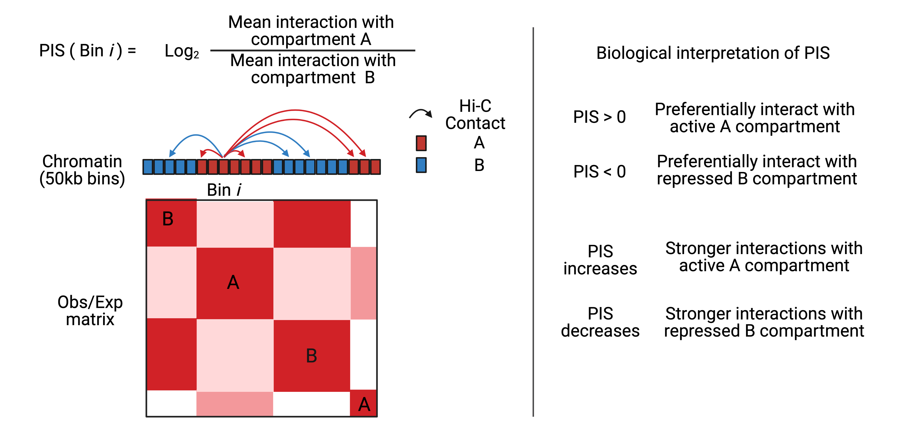
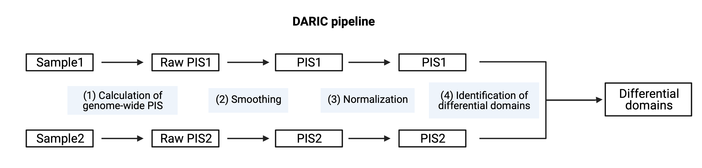

<div align="center">

  
  <h1>DARIC is just published at BMC Genomics! See more details [here](https://bmcgenomics.biomedcentral.com/articles/10.1186/s12864-023-09675-w) </h1>
  <p>
    A computational framework to find <span style="color:red"> ***quantitatively***</span> differential compartments between Hi-C datasets
  </p>

[](https://img.shields.io/badge/daric-v0.2.18-brightgreen)
[](https://pepy.tech/project/daric)
[](https://www.python.org/)
[](https://github.com/Naereen/StrapDown.js/blob/master/LICENSE)
[](https://GitHub.com/Naereen/StrapDown.js/graphs/commit-activity)

<div align="left">


`DARIC`, or Differential Analysis for genomic Regions' Interaction with Compartments, is a computational framework to identify the quantitatively differential compartments from Hi-C-like data. For more details about the design and implementation of the framework, please check our paper published at [BMC Genomics](https://bmcgenomics.biomedcentral.com/articles/10.1186/s12864-023-09675-w).

# About DARIC
## 1. Preferential Interaction Score
PIS is used for measuring the compartmentalization type and strength for a genomic bin at a selected resolution. PIS is defined as the log-transformed ratio of the average interactions with compartments A to B.



## 2. DARIC pipeline
DARIC includes the following four steps to identify genomic domains with quantitatively differential compartmentalization changes.

1. Calculation of the genome-wide PIS for the samples;
2. Smoothing of PIS in each sample to remove technical noises;
3. Normalization.
4. Identifying differential domains by a Hidden Markov Model and performing statistical analyses. 




# Installation
1. Install with `pip`.
	+ `$ pip install daric`
	+ To test the installation, please type `$ daric --help` in shell to see if help messages pop out.

# Required files to start a DARIC analysis
It requires two types of information to start a DARIC analysis: (1) Compartment type information, i.e. PC1 values from [HOMER](http://homer.ucsd.edu/homer/interactions2/HiCpca.html) or eigenvectors from [Juicer](https://github.com/aidenlab/juicer). (2) Normalized contact matrice for each chromosome resulted from juicertools. 

## 1. PC1 track or eigenvectors
The compartment type information can be the PC1 values or eigenvalues for each genomic bin in .bigwig format. By default, a positive value represents that the associated genomic bin is in active compartment A, and a negative value represents inactive compartment B. 

## 2. Normalized contact matrice
DARIC requires to take the OE normalized contact matrice for each individual chromasome from juicertools. Specifically, these contact matrice can be obtained by the following command. 

```
java -jar juicer_tools.1.7.5_linux_
x64_jcuda.0.8.jar dump oe KR sample.hic $i $i BP 50kb sample_OE_matrix
# i is chromsome number, please see details in the juciertools github page. 
```
The normalized contact matrix will be in the `sample_OE_matrix` folder. The path of `sample_OE_matrix` will be used in the PIS calculation command below.


# Usage
`DARIC` is composed of three commands: `calculate`, `normalize`, and `runhmm`. 

## 1. Calculation of PIS
---
PIS, or Preferential Interaction Score, is a metric that we used to evaluate the relative interaction strength between the A and B compartments. `calculate` is the command to calculate the PIS:


```
Usage: daric calculate [OPTIONS]

Options:
  -n, --name TEXT     sample names used for output  [required]
  -p, --pc1 TEXT      the PC1 bigwig file for compartments  [required]
  -m, --hic TEXT      the directory with the o/e interaction matrice in sparse format. Note that it has to be the output from juicer dump.  [required]
  -r, --reso INTEGER  the genomic resolution (in bp) for compartment bins and hic file  [required]
  -s, --species TEXT  species (mm9, mm10, hg19, hg38)  [required]
  -o, --outdir TEXT   path for output directory  [default: ./]
  --help              Show this message and exit.
```
Please note that the resolution of the contact matrice in `-m` parameter has to be the same as the value assigned by `-r`. The resolution or bin size in the PC1 track (i.e. `-p`) can be different from the assigned resolution. Resolution of the output PIS is determined by `-r`.

## 2. Normalization of two PIS tracks
---
We borrowed the idea of MAnorm, a normalization method designed for normalizing ChIP-seq datasets, to normalize the PIS data. `normalize` is the command for this task:

```
Usage: daric normalize [OPTIONS]

Options:
  -m, --sample1 TEXT      name of sample1, e.g. name of the cell-type
                          [required]

  -n, --sample2 TEXT      name of sample2  [required]
  -p, --sample1_PIS TEXT  the PIS track(s) for sample1. Multiple files, like
                          replicates, can be separated by comma without space.
                          [required]
  -q, --sample2_PIS TEXT  the PIS track(s) for sample2. Multiple files, like
                          replicates, can be separated by comma without space.
                          [required]
  -f, --fraction FLOAT    A value between 0 and 1. Genomic regions whose
                          residual PIS locate in the top and bottom XX
                          fraction are excluded in building the MAnorm model
                          to infer the systematic scaling differences between
                          the two samples.  [default: 0.15]

  -r, --reso INTEGER      an integer representing the genomic resolution for
                          compartment bins in the PIS track, in bp  [required]

  -s, --species TEXT      species (mm9, mm10, hg19, hg38)  [required]
  -o, --outdir TEXT       output directory  [default: ./]
  --help                  Show this message and exit.
```

## 3. Identification of differential comparments
`runhmm` is the command to identify the quantitatively differential compartments and perform statistical analyses. 

```
Usage: daric runhmm [OPTIONS]

Options:
  -n, --comparison TEXT  the name for the comparison  [required]
  -f, --deltaPIS TEXT    the delta scores for different comparisons. Multiple
                         files should be separated by comma  [required]

  -r, --reso INTEGER     an integer representing the genomic resolution for
                         compartment bins in the PIS track, in bp  [required]

  -s, --species TEXT     species (mm9, mm10, hg19, hg38)  [required]
  -o, --outdir TEXT      output directory  [default: ./]
  --help                 Show this message and exit.

```
# Citation
If you find DARIC useful in your research, please cite our paper [here](https://bmcgenomics.biomedcentral.com/articles/10.1186/s12864-023-09675-w).